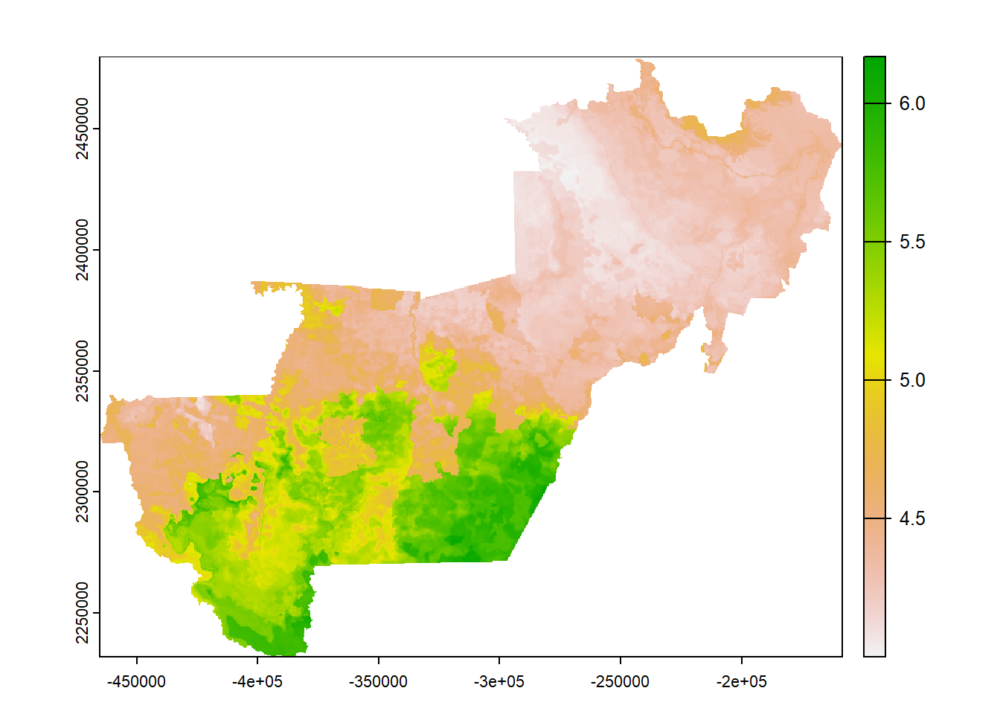
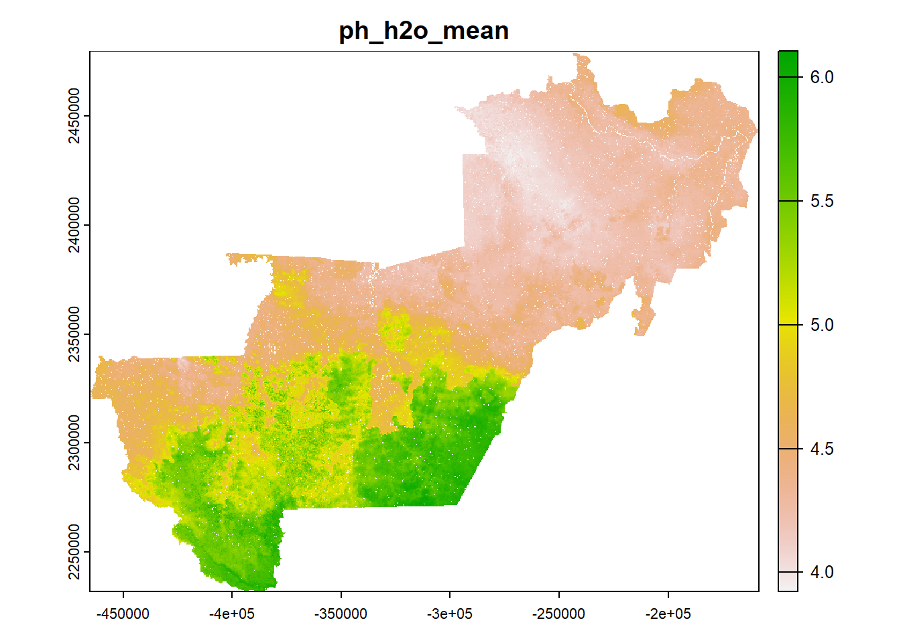
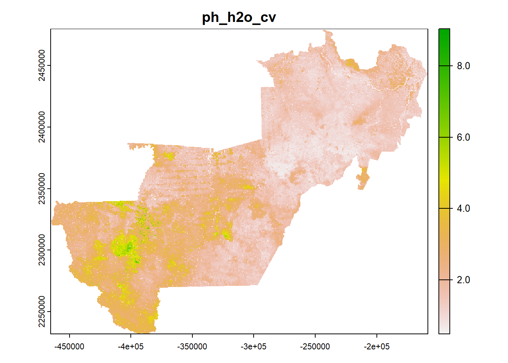
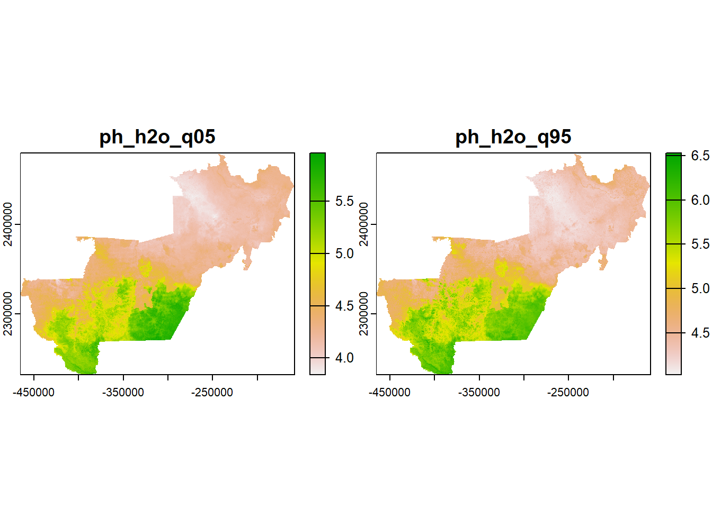

## Loading packages
```{r message=FALSE, warning=FALSE}
pkg <- c("dplyr", "caret", "randomForest", "e1071", "ggplot2", "doParallel", "tidyr", "stringr", "parallelly", "quantregForest", "parallel", "terra", "data.table", "sf")
sapply(pkg, require, character.only = T)
```

## Cleaning the environment (removing objects and previously loaded packages)
```{r message=FALSE, warning=FALSE}
rm(list = ls())  
gc()
```

# Loading rasters os predictors
```{r message=FALSE, warning=FALSE}
lr <- list.files(path = "./predictors/full", pattern = ".tif$",
                 full.names = T) %>% 
  rast()

r_base <- lr %>% 
  subset("dem")
```

## Loading models and names os predictors 
```{r message=FALSE, warning=FALSE}
load("./regression/results/rf/ph_h2o/img/ph_h2o.RData")

varfact <- c("curvature_classification", "geology", "geomorphons", "landforms_tpi_based", "surface_specific_points", "rookeries", "terrain_surface_classification_iwahashi", "valley_idx", "vegetation") %>% sort()
```

## Prediction of the 100 rasters
```{r eval=FALSE, message=FALSE, warning=FALSE, include=TRUE}
for (i in seq_along(lmodel)) {
  
  t1 <- Sys.time()
  
  rst <- lr %>% 
    subset(lrfepred[[m]]) %>% 
    terra::as.data.frame(rst_tiles_frag, xy = T,
                         na.rm = T)
  
  if (grepl(x = paste(lrfepred[[m]], collapse = " "),
            pattern = paste(varfact, collapse = "|"))) {
    
    rst <- rst %>% 
      mutate_at(.vars = vars(contains(varfact)), as.factor)
    
  }
  
  rst <- predict(lmodel[[m]], rst[, -c(1, 2)]) %>% 
    cbind(rst[, c(1, 2)], .)
  
  names(rst)[3] <- var
  
  rst <- rst %>% 
    terra::rast(type = "xyz", crs = "ESRI:102015")
  
  if (!file.exists(paste0("./regression/results/rf/ph_h2o/raster"))) {
    dir.create(paste0("./regression/results/rf/ph_h2o/raster"))
  } 
  
  if (!compareGeom(rst, r_base, stopOnError = F)){
    rst <- resample(rst, r_base, method = "near")
  }
  
  terra::writeRaster(rst, overwrite = T,
                     gdal = c("COMPRESS=LZW"),
                     filename = paste0("./regression/results/rf/ph_h2o/raster/",
                                       names(rst),"_", i, ".tif"))
  
  print(paste("model", i, round(Sys.time() - t1, 2),
              units(Sys.time() - t1)))
  
  plot(rst, main = paste("model", i))
  
  gc()
}
```

<p align="center">

</p>

## Calculating the mean raster, the coefficient of variation and the quantiles
```{r message=FALSE, warning=FALSE}
lp <- list.dirs(path = "./regression/results/rf",
                full.names = T, recursive = F)

head(lp)

lpn <- list.dirs(path = "./regression/results/rf",
                 full.names = F, recursive = F)

ter <- st_read("./vect/ro_territorio.shp") %>% 
  st_transform(crs = "ESRI:102015") %>% 
  group_by(territr) %>% 
  summarize() %>% 
  filter(territr == "Vale do Jamari") %>% 
  vect()
```


### Calculating the mean raster
```{r eval=FALSE, message=FALSE, warning=FALSE, include=TRUE}
rstm <- list.files(path = paste0(lp[i], "/raster"),
                   pattern = ".tif$", full.names = T) %>% 
  rast() %>% 
  app("mean", cores = 7) %>% 
  `names<-`(paste0(lpn[i], "_mean"))

plot(rstm, main = names(rstm))
```

<p align="center">

</p>

### Calculating the coefficient of variation
```{r eval=FALSE, message=FALSE, warning=FALSE, include=TRUE}
rstsd <- list.files(path = paste0(lp[i], "/raster"),
                    pattern = ".tif$", full.names = T) %>% 
  rast() %>% 
  app("mean", cores = 7) %>% 
  `names<-`(paste0(lpn[i], "_sd"))

rstcv <- rstsd / rstm * 100

names(rstcv) <- paste0(lpn[i], "_cv")

plot(rstcv, main = names(rstcv))
```

<p align="center">

</p>

### Calculating the quantiles
```{r eval=FALSE, message=FALSE, warning=FALSE, include=TRUE}
rstqtl <- list.files(path = paste0(lp[i], "/raster"),
                     pattern = ".tif$", full.names = T) %>% 
  rast() %>% 
  terra::quantile(probs = c(0.05, 0.95)) %>% 
  `names<-`(c(paste0(lpn[i], "_q05"), paste0(lpn[i], "_q95")))

plot(rstqtl, main = names(rstqtl))
```

<p align="center">

</p>

## Saving rasters
```{r eval=FALSE, message=FALSE, warning=FALSE, include=TRUE}  
if (!dir.exists(paste0("./regression/results/rf/ph_h2o/raster_summary"))) {
  dir.create(paste0("./regression/results/rf/ph_h2o/raster_summary"))
}

if (!compareGeom(rstm, r_base, stopOnError = F)){
  
  rstm <- resample(rstm, r_base, method = "near")
  
  writeRaster(rstm,
              filename = paste0("./regression/results/rf/ph_h2o/raster_summary/", 
                                names(rstm), ".tif"),
              gdal = c("COMPRESS=LZW"), overwrite = T)
  
} else {
  
  writeRaster(rstm,
              filename = paste0("./regression/results/rf/ph_h2o/raster_summary/", 
                                names(rstm), ".tif"),
              gdal = c("COMPRESS=LZW"), overwrite = T)
  
}

if (!compareGeom(rstcv, r_base, stopOnError = F)){
  
  rstcv <- resample(rstcv, r_base, method = "near")
  
  writeRaster(rstcv,
              filename = paste0("./regression/results/rf/ph_h2o/raster_summary/", 
                                names(rstcv), ".tif"),
              gdal = c("COMPRESS=LZW"), overwrite = T)
  
} else {
  
  writeRaster(rstcv,
              filename = paste0("./regression/results/rf/ph_h2o/raster_summary/", 
                                names(rstcv), ".tif"),
              gdal = c("COMPRESS=LZW"), overwrite = T)
  
}

if (!compareGeom(rstqtl, r_base, stopOnError = F)){
  
  rstqtl <- resample(rstqtl, r_base, method = "near")
  
} 

writeRaster(rstqtl[[1]],
            filename = paste0("./regression/results/rf/ph_h2o/raster_summary/", 
                              names(rstqtl)[[1]], ".tif"),
            gdal = c("COMPRESS=LZW"), overwrite = T)

writeRaster(rstqtl[[2]],
            filename = paste0("./regression/results/rf/ph_h2o/raster_summary/", 
                              names(rstqtl)[2], ".tif"),
            gdal = c("COMPRESS=LZW"), overwrite = T)
```
